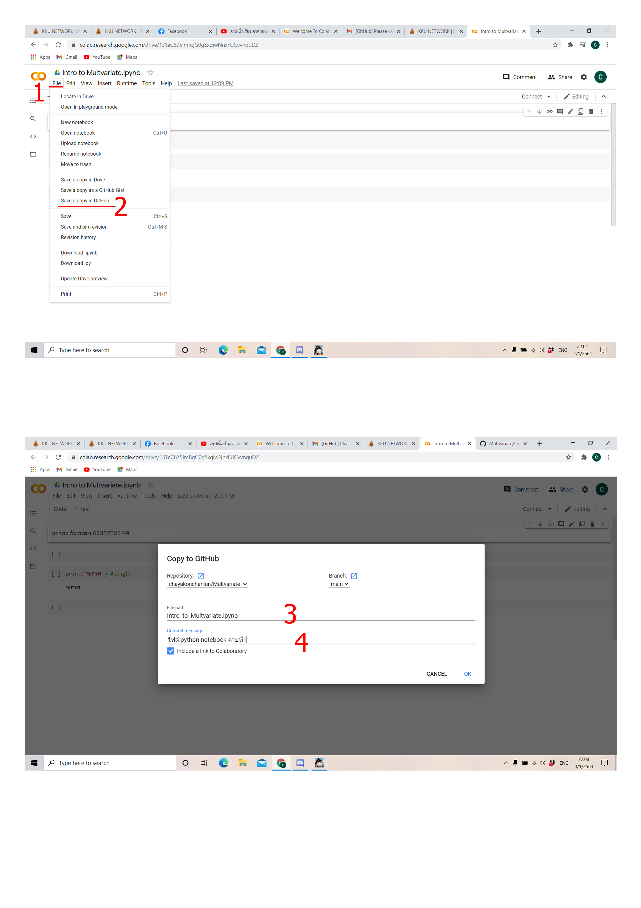

# Multvariate

### ชยากร 623020517-9

.md => Markdown

อธิบายารใช้ Github และ Google colab ว่าหน้าที่ของแต่ละอันคืออะไร และอธิบายวิธีเซฟไฟล์จาก Google Colab ลงใน Github

## Github
คือ เเหล่งช่วยเก็บรักษาไฟล์เเละรวบรวมไฟล์ที่สามารถเเชร์ให้อื่นเข้ามาทำการเเก้ไขโค้ดหรือดูโค้ดที่เราเขียนได้

## Google Colab
เป็นโปรเเกรมอินเตอร์เฟสที่ใช้ในการเขียน ข้อความ รวมถึง โค้ด เเละสามารถเชื่อมต่อกับ github เพื่อให้มีการทำงานที่สะดวกขึ้น

## การเซฟไฟล์จาก Google Colab ลงใน Github
มีขั้นตอนคือ 
1.file 
2.บันทึกสำเนาใน github 
3.ตั้งชื่อไฟล์ 
4.ใส่ comment

